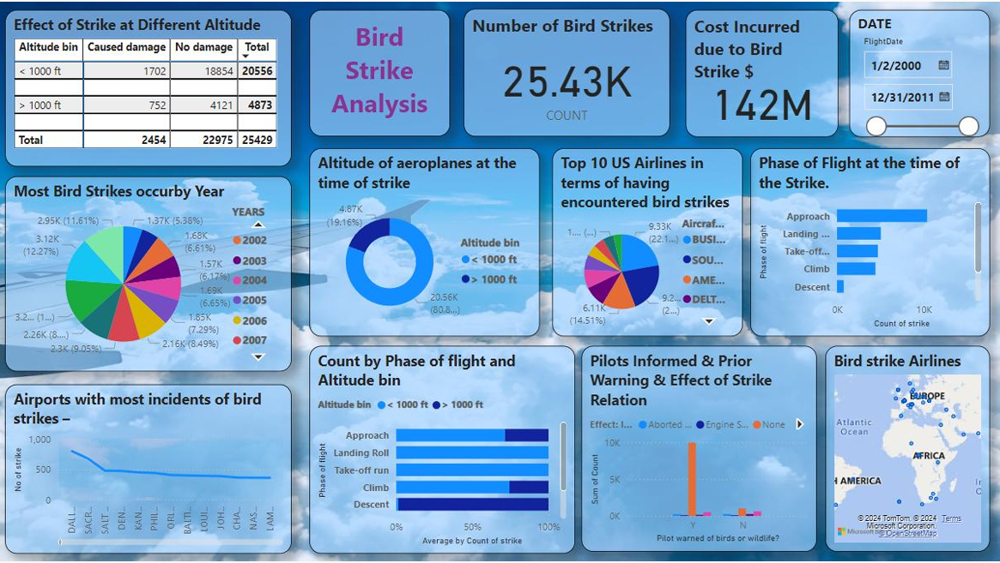

# 📊 Power BI Dashboard Projects Portfolio

    

    

## 🚀 Data Science Internship Showcase - Unified Mentor

This portfolio showcases the Power BI dashboard projects I completed during my **one-month remote Data Science internship** at **Unified Mentor**. These projects demonstrate my proficiency in the end-to-end process of data analysis, from cleaning and transformation to creating impactful, interactive data visualizations.

---

This repository contains a portfolio of Power BI dashboard projects showcasing my skills in **data cleaning, transformation, and visualization**. Each project addresses a unique dataset and business problem, providing interactive dashboards and meaningful insights.

---

💼 **How to Use This Repo**

Each project is stored in a separate folder and includes:

* **.pbix** Power BI file
* **.pdf** presentation file
* **README.md** with project details

Feel free to explore the dashboards or download the **.pbix** files to open in Power BI Desktop.

---

🎓 **Tools & Technologies**

* **Microsoft Power BI**
* **Pandas and Numpy 
* **Jupyter Notebook
